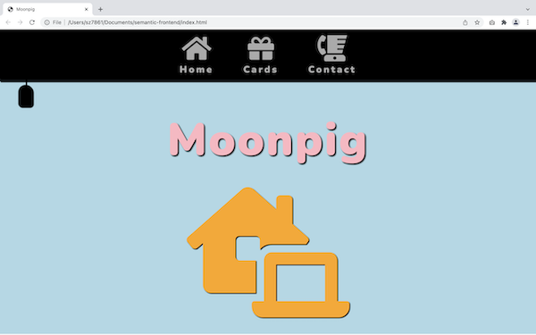
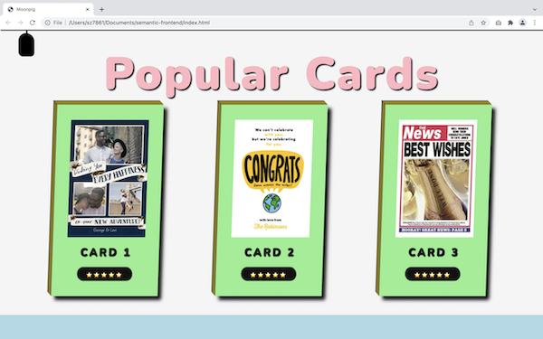
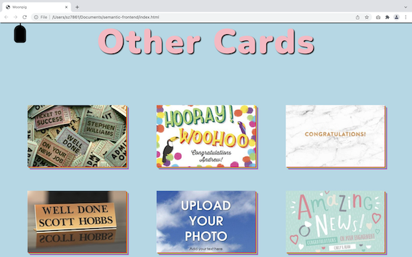

# Semantic-frontend

## Instructions

View the live application here: https://mz0121coder.github.io/semantic-frontend/

## Overview

This is my submission for a frontend coding challenge.  
I didn't use any popular libraries or frameworks such as React, Bootstrap and Tailwind.

Instead I focussed on writing clean, semantic HTML and CSS that is organised and follows best practices.

## User Story

```
As a customer I can view a list of available cards on my mobile, tablet and desktop
so that I can celebrate my new job.

As a customer I can view more details of a card so that I can decide if
it's the right card for me before purchase.
```

## Features

The UI has been built to include work-related icons that show in sequence at 4 second intervals.

At the top of the page, there is a dropdown menu with 3 more fontawesome icons that have a hover effect and varying transitions (home, cards, contact).

Popular cards are previewed with a box shadow, followed by a selection of 9 landscape cards that are representative of the nature of this task. The user can view more details by clicking on their image, being redirected to the respective page on Moonpig's UK website.

Each section has been customised while still keeping the code clear and simple to follow. I have also created responsive breakpoints for different devices.

## Further Development

Due to several challlenges with CORS, time limitations and other commitments, I didn't manage to integrate the Moonpig API.

If this was done, I would have tried to add search functionality to explore more cards on the same page.

Overall, this was a great way to practice the fundamentals and (attempt to) write some clean code.

## Screenshots





## Demo


